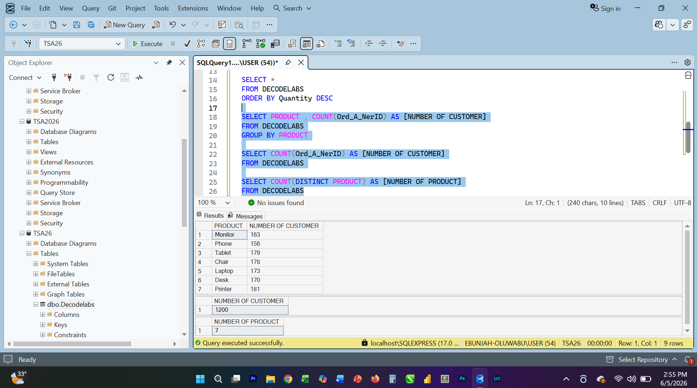
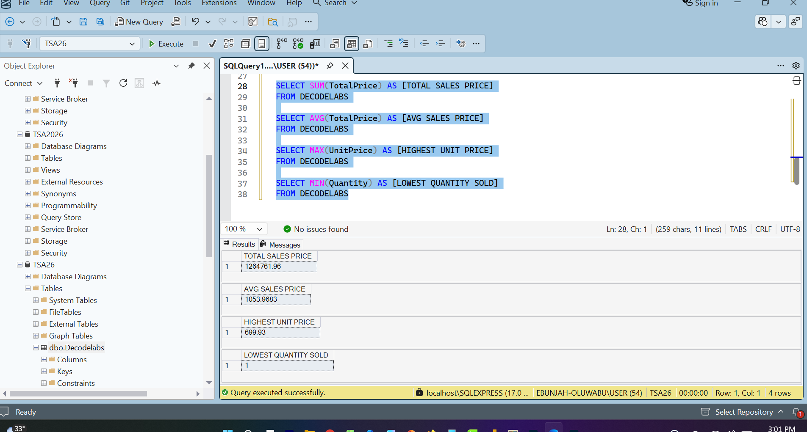

# Week 3 SQL Fundamentals Project

## Project Overview
SQL fundamentals project focused on data querying, filtering, sorting, grouping, and aggregation to extract meaningful insights from a dataset.

## Objectives
- Write SELECT queries
- Filter data using WHERE
- Sort data using ORDER BY
- Summarize data using GROUP BY
- Perform aggregations using COUNT, SUM, and AVG

## Tools Used
- SQL Server Management Studio (SSMS)

## SQL Concepts Applied
- SELECT
- WHERE
- ORDER BY
- GROUP BY
- COUNT()
- SUM()
- AVG()

## Key Insights
- Identified the total number of records.
- Calculated total and average values.
- Analyzed grouped data by category.
- Filtered records based on specific conditions.

## Overview

## Select Query

## Group By Query

## Aggregation Query

